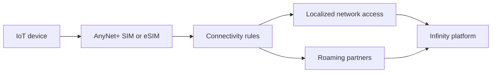

# AnyNet Federation

The AnyNet Federation is Eseye's model for global IoT connectivity: a managed network ecosystem that gives devices access to many network options without customers having to negotiate and operate every carrier relationship themselves.

## When it matters

- Devices ship across multiple countries or regions.
- Permanent roaming creates regulatory or availability risk.
- A deployment needs multiple network choices in each market.
- The operations team wants one commercial and support relationship.

## Deployment guidance



## Confirm target countries

List launch markets, expected device volumes, data usage, and regulatory constraints.



## Pick the connectivity model

Choose the SIM, eSIM, profile, and failover pattern that fits the device lifetime.



## Define operating rules

Document network preference, alert thresholds, localization requirements, and escalation paths.



## Where to go next

- Review [AnyNet+ SIMs and profiles](anynet-sims-and-profiles.md).
- Set operational controls in [Infinity platform](infinity-platform.md).
- For device-side choices, see [Hera router overview](https://app.gitbook.com/s/kpggc3qX0IYi8Lu0z7Tm/product-families/hera-router-overview).
