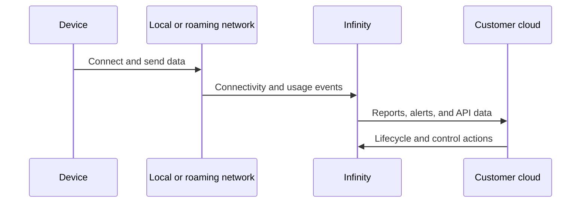

# Connectivity overview

When you design an IoT deployment, you need to decide how device data moves from the edge into your network, applications, and operational workflows.

## Design questions



### Device and network

- Which radio technology does the device use?
- Which countries will devices operate in?
- What happens when the preferred network is unavailable?
- What data usage pattern is expected?



### Platform and operations

- Who monitors connection health?
- Which alerts should trigger support action?
- Which systems need usage or diagnostic data?
- Which API workflows should be automated?



## Suggested architecture

