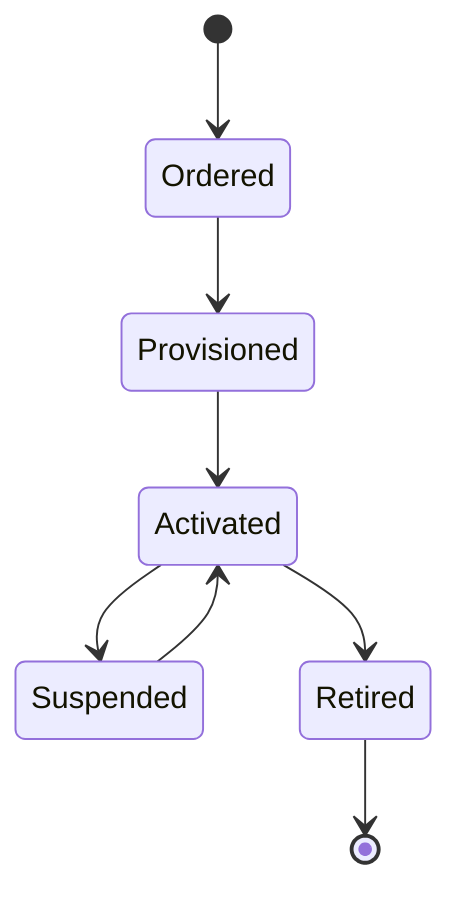

# SIM lifecycle controls

A global IoT estate needs a consistent lifecycle model. SIM status, billing state, device assignment, profile status, and country availability all need clear ownership.

## Lifecycle stages

## Controls to document

- Who can activate a SIM?
- What evidence is required before suspending or retiring?
- Which status changes should alert support or customer success?
- Which reports feed finance, support, and customer-facing reviews?


This is a strong candidate for authenticated customer-only docs in a second pass because lifecycle rules often vary by contract, device estate, and support model.

