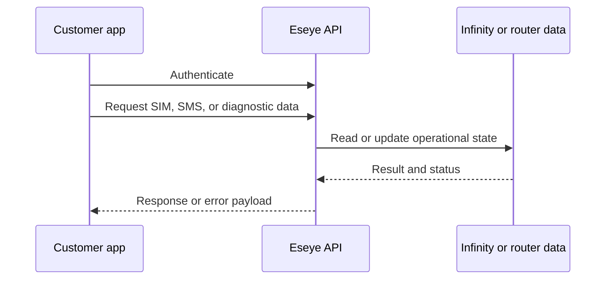

# Choosing an API

<table>
<thead><tr><th>Need</th><th>Use</th><th>Example task</th></tr></thead>
<tbody>
<tr><td>SIM and portfolio operations</td><td>SIM API and Portfolio API</td><td>View, create, update, or manage SIM and portfolio records.</td></tr>
<tr><td>Send or receive SMS</td><td>SMS API</td><td>Send mobile terminated SMS, process mobile originated SMS, and handle delivery receipts.</td></tr>
<tr><td>Router diagnostics</td><td>Tigrina API</td><td>Query Hera 604 device parameters, cellular connectivity, RSSI history, and network information.</td></tr>
<tr><td>Operational reporting</td><td>Infinity exports or APIs</td><td>Automate recurring connectivity checks and support reports.</td></tr>
</tbody>
</table>

## Common integration flow

