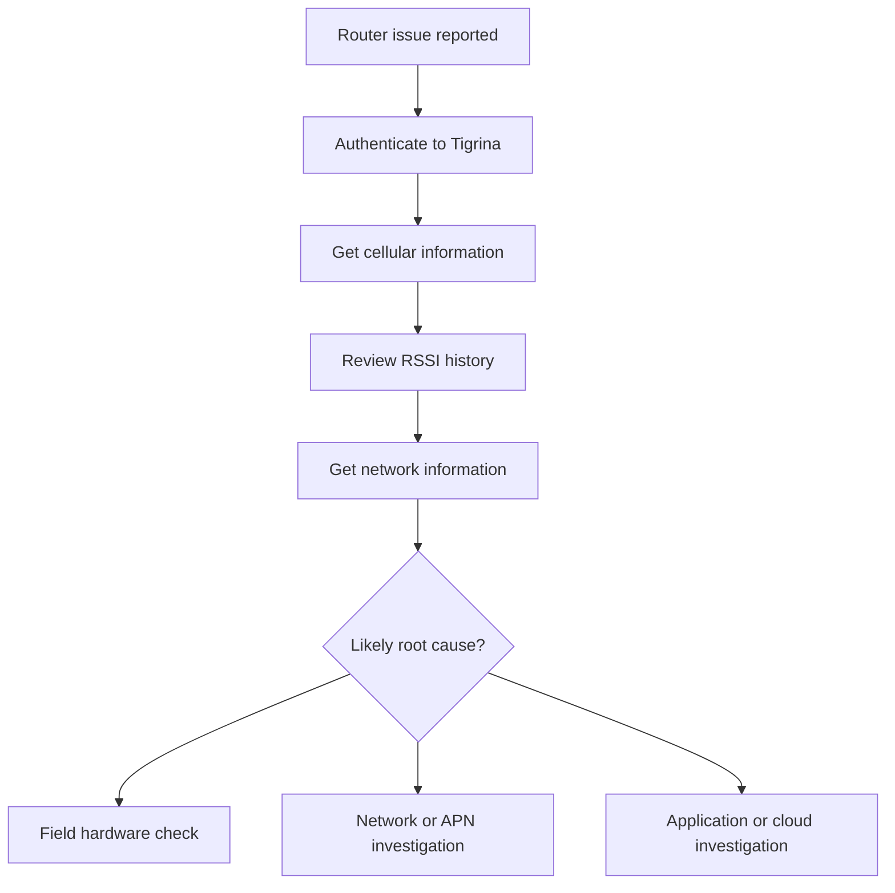

# Tigrina API

The Tigrina API enables access to Hera 604 router information, including device parameters, cellular connectivity information, RSSI history, and network information.

## Representative requests

- `POST /Japi/Diam/login`
- `GET /Japi/Diam/getCellularInformation`
- `GET /Japi/Diam/getCellularRSSIHistory`
- `GET /Japi/Diam/getNetworkInformation`

## Diagnostic workflow


Pair Tigrina diagnostics with the [troubleshooting device connectivity](https://app.gitbook.com/s/XSPACE_HARDWARE/troubleshoot-device-connectivity) flow so support can move from API evidence to field action.

