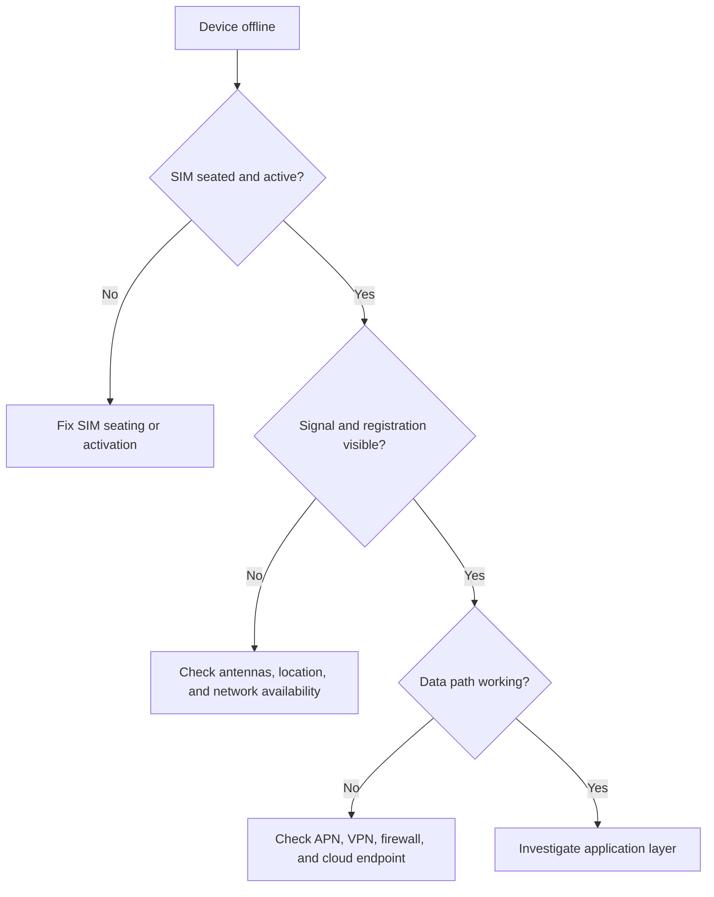

# Troubleshoot device connectivity

Start with physical checks, then platform status, then network diagnostics. This keeps field teams from jumping straight into advanced network investigation when the cause may be local.

## Quick checks

- SIM is seated and activated.
- Antennas are attached and undamaged.
- Router status shows cellular registration.
- Infinity shows expected SIM status and recent activity.
- VPN, private APN, firewall, and cloud endpoints are reachable.

## Escalate with evidence

Capture router model, firmware version, SIM identifier, location, signal data, network state, recent changes, and timestamps before escalating.
