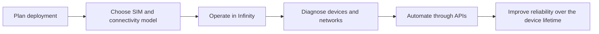

# Eseye Documentation Hub


{% column width="58%" %}
Eseye's current documentation spans product education, SIM and router guidance, Infinity platform workflows, and API references. This demo keeps that familiar shape but gives the first page a clearer set of routes for enterprise IoT teams.

<a class="button primary" href="https://www.eseye.com/">Explore Eseye</a>
<a class="button secondary" href="https://docs.eseye.com/Content/Home.htm">Original docs</a>

<button type="button" class="button primary" data-action="ask" data-icon="gitbook-assistant">Ask the Eseye docs</button>
<button type="button" class="button secondary" data-action="ask" data-query="How should I start a global IoT deployment with Eseye?" data-icon="tower-cell">Deployment path</button> <button type="button" class="button secondary" data-action="ask" data-query="Which API should I use for SIM, SMS, and router diagnostics?" data-icon="code">API choice</button>


{% column width="42%" %}

**Demo thesis**

GitBook can preserve Eseye's broad support surface while making it easier for customers to choose a path: deploy connectivity, manage devices, operate hardware, or integrate through APIs.




***



<table data-view="cards">
  <thead>
    <tr>
      <th width="48"></th>
      <th></th>
      <th></th>
      <th data-hidden data-card-target data-type="content-ref"></th>
    </tr>
  </thead>
  <tbody>
    <tr>
      <td><i class="fa-tower-cell" style="color:#00A6D6;"></i></td>
      <td><strong>Connectivity and platform</strong></td>
      <td>AnyNet Federation, AnyNet+ SIMs, Infinity, SIM lifecycle controls, and global connectivity operations.</td>
      <td><a href="https://app.gitbook.com/s/wGjO4exwMd6xQT3Tvl1R/">connectivity</a></td>
    </tr>
    <tr>
      <td><i class="fa-router" style="color:#00A6D6;"></i></td>
      <td><strong>Hardware and devices</strong></td>
      <td>Hera routers, SIM form factors, module setup, installation, basic settings, and troubleshooting paths.</td>
      <td><a href="https://app.gitbook.com/s/kpggc3qX0IYi8Lu0z7Tm/">hardware</a></td>
    </tr>
    <tr>
      <td><i class="fa-code" style="color:#00A6D6;"></i></td>
      <td><strong>Developer APIs</strong></td>
      <td>Start using APIs, pick the right API family, send SMS, manage SIMs, and query Hera router diagnostics.</td>
      <td><a href="https://app.gitbook.com/s/em511mV5ELwahit6jfD1/">developer APIs</a></td>
    </tr>
  </tbody>
</table>





<table data-view="cards">
  <thead>
    <tr>
      <th width="48"></th>
      <th></th>
      <th></th>
      <th data-hidden data-card-target data-type="content-ref"></th>
    </tr>
  </thead>
  <tbody>
    <tr>
      <td><i class="fa-tower-cell" style="color:#00A6D6;"></i></td>
      <td><strong>Connectivity and platform</strong></td>
      <td>AnyNet Federation, AnyNet+ SIMs, Infinity, SIM lifecycle controls, and global connectivity operations.</td>
      <td><a href="https://app.gitbook.com/s/wGjO4exwMd6xQT3Tvl1R/">connectivity</a></td>
    </tr>
    <tr>
      <td><i class="fa-router" style="color:#00A6D6;"></i></td>
      <td><strong>Hardware and devices</strong></td>
      <td>Hera routers, SIM form factors, module setup, installation, basic settings, and troubleshooting paths.</td>
      <td><a href="https://app.gitbook.com/s/kpggc3qX0IYi8Lu0z7Tm/">hardware</a></td>
    </tr>
  </tbody>
</table>



## Built for the real support journey

## Why this structure works

- It keeps the current customer mental model: product docs, hardware docs, and API docs.
- It adds a clearer first screen for enterprise buyers, project leads, support teams, and developers.
- It gives GitBook AI and MCP a cleaner content graph than a flat help-system export.
- It leaves room for private customer-only content later, such as contract-specific connectivity rules or partner procedures.
