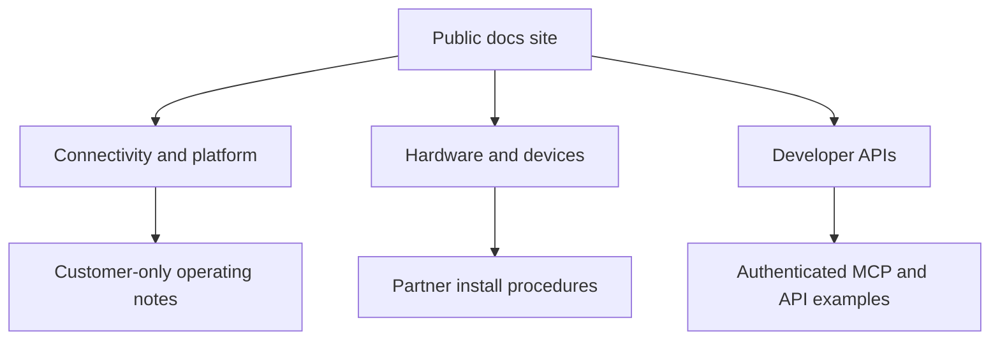

# Recommended GitBook architecture

Eseye has multiple reader types: enterprise buyers, IoT solution architects, field engineers, device teams, support teams, and API developers. The public docs should stay easy to browse, but the same site can later unlock authenticated content for customers and partners.

## Suggested spaces

<table data-view="cards">
  <thead><tr><th></th><th></th><th></th></tr></thead>
  <tbody>
    <tr><td><strong>Home</strong></td><td>Public front door, source mapping, and review notes.</td><td>Useful for demo narrative and buying committee orientation.</td></tr>
    <tr><td><strong>Connectivity and platform</strong></td><td>AnyNet, Infinity, SIM lifecycle, network controls, and security.</td><td>Best fit for project owners and solution architects.</td></tr>
    <tr><td><strong>Hardware and devices</strong></td><td>Hera routers, SIMs, modules, installation, configuration, and troubleshooting.</td><td>Best fit for field teams and device teams.</td></tr>
    <tr><td><strong>Developer APIs</strong></td><td>API onboarding, authentication, SIM, SMS, Tigrina, and operational patterns.</td><td>Best fit for developers and platform teams.</td></tr>
  </tbody>
</table>

## Future upgrade paths


A strong GitBook Enterprise pitch for Eseye is not just prettier docs. It is one source of truth for public docs, customer-only implementation guidance, authenticated AI answers, and MCP-accessible documentation for engineering agents.

